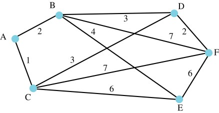

# Dijkstra’s Algorithm

Dijkstra’s algorithm solves single-source shortest-paths problem. It is a type of greedy algorithm.

## Assumptions of Dijkstra's Algorithm

1. The graph is connected.
2. The edges are undirected.
3. The edge weights are **non-negative**.

## Edge Relaxation

Edge relaxation is a helper function.


Stretch it first, then relax, so it's called relaxation.


1. Let $$D[u]$$denote the length of the best path from$$v$$to$$u$$that could have been found **so far**.
2. Initially,$$D[v]=0$$, and$$D[u]=\infty$$for each other vertex$$u$$in the graph. 
3. $$D[u]$$will afterwards be updated if a better path is found that results in a smaller shortest path value to$$u$$. This step is relaxation.

## Dijkstra's Algorithm

### Two sets

* $$C$$contains the vertices which we have already found the shortest paths to them.
  * After a vertex was put in$$C$$,  we should never update it again, because the solution has been found at the moment it was put in.
* $$S$$contains the vertices connecting to the vertices in$$C$$.

### Steps

1. Initially,$$C=\emptyset, S=\{v\}$$, where $$v$$is the starting vertex.
2. Do edge relaxation initialization; that is,$$D[v]=0$$and$$D[u]=\infty$$for each other vertex$$u$$.
3. Select the vertex$$s$$in$$S$$who has the shortest path to$$v$$,.
   1. Move$$s$$to$$C$$.
   2. For every vertex which is connected to$$s$$and not in$$C$$, do edge relaxation.
   3. Add these connected vertices to$$C$$.
4. Repeating step$$#3$$util $$S=\emptyset$$.

## Example

1. $$C=\emptyset, S=\{A\}$$
2. $$D[A]=0, D[B]=\infty,D[C]=\infty,D[D]=\infty,D[E]=\infty,D[F]=\infty$$
3. Move the vertex$$A$$from$$S$$to$$C$$because $$D[A]$$is the smallest one among all vertices in$$S$$.
   * Currently, only one vertex in$$S$$, so it is the chosen one.
   * $$C=\{A\},S=\emptyset$$
4. Relax$$D[B]$$and$$D[C]$$because $$B,C$$ are connected to$$A$$and they are **not** in the set$$C$$.
   * $$D[B]=2<\infty$$
   * $$D[C]=1<\infty$$
5. Put $$B,C$$in the set$$S$$.
   * $$C=\{A\},S=\{B,C\}$$
6. Move the vertex$$C$$from$$S$$to$$C$$because$$D[C]<D[B]$$
   *  $$C=\{A,C\},S=\{B\}$$
7. Relax$$D[D],D[E],D[F]$$because$$D,E,F$$are connected to the vertex$$C$$and they are **not** in the set$$C$$.
   * $$D[D]=D[C]+e_{CD}=4<\infty$$
   * $$D[E]=D[C]+e_{CE}=7<\infty$$
   * $$D[F]=D[C]+e_{CF}=8<\infty$$
8. Put$$D,E,F$$in the set$$S$$.
   * $$C=\{A,C\},S=\{B,D,E,F\}$$
9. Move the vertex$$B$$from$$S$$to$$C$$because$$D[B]<D[D]<D[E]<D[F]$$.
   * $$C=\{A,C,B\},S=\{D,E,F\}$$
10. Relax $$D[D],D[E],D[F]$$because $$D,E,F$$are connected to$$B$$and they are **not** in the set$$C$$.
    * $$D[D]=D[B]+e_{BD}=5>4$$

      ❌ $$D[D]$$ should not be updated because its previous value is smaller.

    * $$D[E]=D[B]+e_{BE}=6<7$$
    * $$D[F]=D[B]+e_{BF}=9>8$$❌ 
11. No more vertices put in the set$$S$$.
    * $$C=\{A,C,B\},S=\{D,E,F\}$$
12. Move $$D$$from $$S$$to$$C$$ because $$D[D]<D[E]<D[F]$$.
    * $$C=\{A,C,B,D\},S=\{E,F\}$$
13. Relax $$D[F]$$.
    * $$D[F]=D[D]+e_{DF}=6<8$$
14. No more vertices put in the set$$S$$.
    * $$C=\{A,C,B,D\},S=\{E,F\}$$
15. Move$$E$$or $$F$$to$$C$$ because$$D[E]=D[F]$$
    * $$C=\{A,C,B,D,E\},S=\{F\}$$
16. Relax$$D[F]$$.
    * $$D[F]=D[E]+e_{EF}=12>6$$❌ 
17. No more vertices put in the set$$S$$.
    * $$C=\{A,C,B,D,E\},S=\{F\}$$
18.  Move$$F$$to$$C$$, now$$S=\emptyset$$.

| $$C$$ | $$S$$ | $$s$$ | $$A$$ | $$B$$ | $$C$$ | $$D$$ | $$E$$ | $$F$$ | $$A$$ | $$B$$ | $$C$$ | $$D$$ | $$E$$ | $$F$$ |
| :--- | :--- | :--- | :--- | :--- | :--- | :--- | :--- | :--- | :--- | :--- | :--- | :--- | :--- | :--- |
| $$\{\}$$ | $$\{A\}$$ | $$A$$ | $$0$$ | $$\infty$$ | $$\infty$$ | $$\infty$$ | $$\infty$$ | $$\infty$$ | $$A$$ | - | - | - | - | - |
| $$\{A\}$$ | $$\{B,C\}$$ | $$C$$ | - | $$2$$ | $$1$$ | $$\infty$$ | $$\infty$$ | $$\infty$$ | - | $$A$$ | $$A$$ | - | - | - |
| $$\{A,C\}$$ | $$\{B,D,E,F\}$$ | $$B$$ | - | $$2$$ | - | $$4$$ | $$7$$ | $$8$$ | - | $$A$$ | - | $$C$$ | $$C$$ | $$C$$ |
| $$\{A,C,B\}$$ | $$\{D,E,F\}$$ | $$D$$ | - | - | - | $$4$$ | $$6$$ | $$8$$ | - | - | - | $$C$$ | $$B$$ | $$C$$ |
| $$\{A,C,B,D\}$$ | $$\{E,F\}$$ | $$E$$ | - | - | - | - | $$6$$ | $$6$$ | - | - | - | - | $$B$$ | $$D$$ |
| $$\{A,C,B,D,E\}$$ | $$\{F\}$$ | $$F$$ | - | - | - | - | - | $$6$$ | - | - | - | - | - | $$D$$ |

