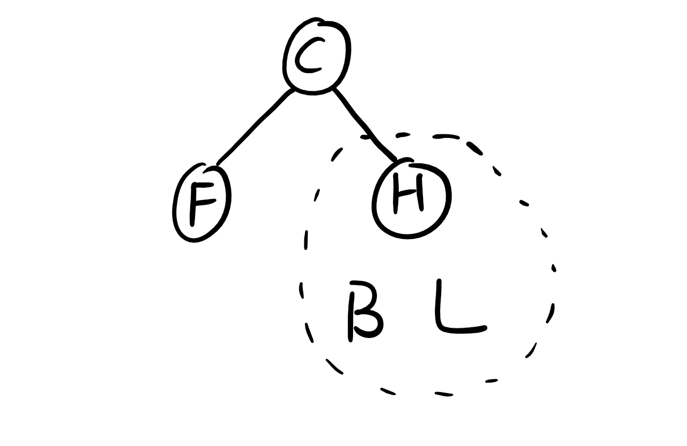

# Traversals

## Question


**Problem** : Draw a tree$$T$$given that:

* A pre-order traversal of $$T$$yields:$$E\ K\ D\ M\ J\ G\ I\ A\ C\ F\ H\ B\ L$$.
* A post-order traversal of$$T$$yields:$$D\ J\ I\ G\ A\ M\ K\ F\ L\ B\ H\ C\ E$$.



Use divide and conquer approach.


1. `pre-order`yields $$E\ K\ D\ M \cdots\Rightarrow E$$ is the root of$$T$$,$$K$$is the first child of$$T$$.
2. `post-order` yields$$\cdots B\ H\ C\ E\Rightarrow E$$is the root of$$T$$,$$C$$is the last child of$$T$$.
3. If$$E$$has another child which is in-between$$K$$and$$C$$ , it should be$$D$$because of `pre-order`. However,$$D$$is the first node in `post-order`, so$$D$$cannot be in-between$$K$$and$$C$$.
4. $$E$$only has a left child$$K$$and a right child$$C\Rightarrow$$
   * From `pre-oder`, $$K\ D\ M\ J\ G\ I\ A$$is a left-sub-tree;$$C\ F\ H\ B\ L$$is a right-sub-tree.
   * From `post-order`,$$D\ J\ I\ G\ A\ M\ K$$is a left-sub-tree;$$F\ L\ B\ H\ C$$is a right-sub-tree.


We have conquered the root$$E$$. Now, this problem was divided into two sub-problems:

* **Problem 1**: Draw a tree$$T_1$$where
  * Pre-order traversal yields: $$K\ D\ M\ J\ G\ I\ A$$.
  * Post-order traversal yields:$$D\ J\ I\ G\ A\ M\ K$$.
* **Problem 2**: Draw a tree$$T_2$$where
  * Pre-order traversal yields:$$C\ F\ H\ B\ L$$.
  * Post-order traversal yields:$$F\ L\ B\ H\ C$$.



**Problem 1**: Draw a tree$$T_1$$where

* Pre-order traversal yields: $$K\ D\ M\ J\ G\ I\ A$$.
* Post-order traversal yields:$$D\ J\ I\ G\ A\ M\ K$$.


We follow the same approach as what we did on$$E$$.

1. $$K$$is the root,$$D$$is the first child of$$K$$and$$M$$is the last child of$$K$$.
   * $$K$$has no more child because if it has a child $$K_C$$, then $$K_C$$would be in-between$$D$$and$$M$$in `pre-order` traversal.
2. Furthermore, we should know that$$M\ J\ G\ I\ A$$is a right-sub-tree of $$T_1$$because of `pre-order`. That is, if$$D$$has children, they should be in-between$$D$$and$$M$$in `pre-order` traversal.


We have conquered the root$$K$$and its left child$$D$$. Now the **Problem 1** was divided into a smaller problem:

* **Problem 1.1**: Draw a tree$$T_{11}$$where
  * Pre-order traversal yields:$$M\ J\ G\ I\ A$$.
  * Post-order traversal yields:$$J\ I\ G\ A\ M$$.



**Problem 1.1**: Draw a tree$$T_{11}$$where

* Pre-order traversal yields:$$M\ J\ G\ I\ A$$.
* Post-order traversal yields:$$J\ I\ G\ A\ M$$.


1. $$M$$is the root of$$T_{11}$$,$$J$$is the first child,$$A$$is the last child.
   * If$$M$$has another child which is in-between$$J$$and$$A$$, it should be$$G$$because of `pre-oder`.
     * If$$G$$is not a child of$$M$$, then it can only be a child of$$J$$because $$G$$is before$$A$$in `pre-order` . However, $$G$$cannot be a child of $$J$$because in `post-order` $$G$$is after$$J$$.
     * So we know $$G$$is a child of$$M$$; that is, $$M$$has three children$$J,G,A$$.
   * What about $$I$$?
     * From $$G\ I\ A$$in `pre-order` we know$$I$$can only be a child of$$G$$. This conclusion is consistent with the fact that in `post-order` they are$$I\ G\ A$$.


**Problem 1.1** Solved!



**Problem 1** Solved!



**Problem 2**: Draw a tree$$T_2$$where

* Pre-order traversal yields:$$C\ F\ H\ B\ L$$.
* Post-order traversal yields:$$F\ L\ B\ H\ C$$.


1. $$C$$is the root of$$T_{2}$$,$$F$$is the first child,$$H$$is the last child.
   * This is the same case as Problem 1: $$F$$is the only left-sub-tree of$$T_{2}$$and$$H\ B\ L$$is the right-sub-tree.


We have conquered the root$$C$$and its left child$$F$$. Now the problem 2 was divided into a smaller problem:

* **Problem 2.1**: Draw a tree$$T_{21}$$where
  * Pre-order traversal yields:$$H\ B\ L$$.
  * Post-order traversal yields:$$L\ B\ H$$.



**Problem 2.1**: Draw a tree$$T_{21}$$where

* Pre-order traversal yields:$$H\ B\ L$$.
* Post-order traversal yields:$$L\ B\ H$$.


1. $$H$$is the root of$$T_{21}$$, the first child is$$B$$, and the last child is$$B$$.
2. So$$H$$only has one child$$B$$, then$$L$$can only be a child of$$B$$.


**Problem 2.1** Solved!



**Problem 2** Solved!



**Problem** solved!


